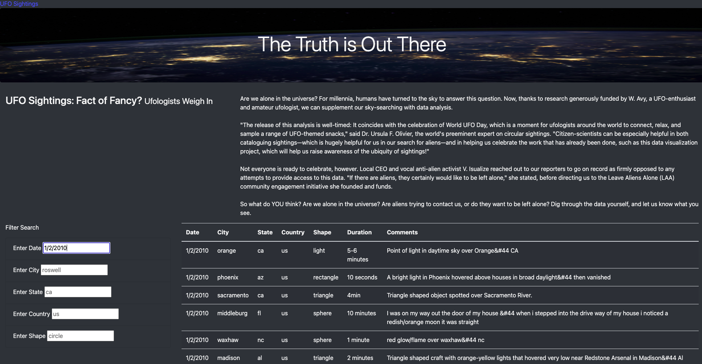

# UFO Finder

## Overview

## Purpose
This analysis and interactive webpage was created to allow those who are interested in learning more about UFO sightings to filter through the large dataset of sightings with the ability to apply filters to narrow down their search (eg. sightings by city, date, etc). 

## Results 
Users can query their UFO searches with ease using the Filter search option on the left side of the page. After entering their search query information and refreshing the webpage the sightings that match the criteria entered will generate in the table data for review in real time. See below for example of UFO Sightings filtered for 1/2/2010.

## Summary
Although this webpage is simple, it saves a lot of time that would normally be spent filtering a large dataset and makes this information more accessible to those who are not well-versed in the coding world. The biggest drawback of this website is it only matches search queries in lowercase letters. When uppercase letters are entered in the search fields, the program is not able to recognize the search term. 

Overall this is a great start to a webpage. Some improvements can be made to the way the Filter Search accepts information to include uppercase queries or at the very least make the format for search more salient so there is no frustration or confusion. This webpage could also be improved by adding Filter searches for the other two columns of table data (duration and comments). This could further help users refine their searches while researching UFO Sighting Data on this page. 